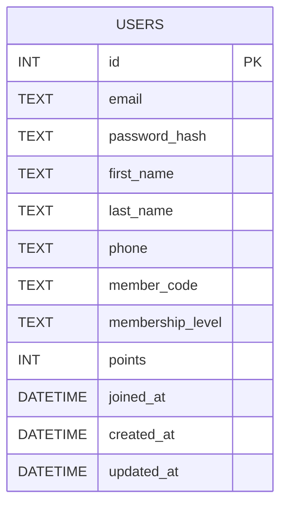

## Database ERD

### Notes

- **USERS**: Master table for application members.
  - **id**: Auto-increment primary key.
  - **email**: Unique login identifier. Indexed and unique in SQLite schema.
  - **password_hash**: Bcrypt hash of the password; never expose in APIs.
  - **first_name / last_name / phone**: Editable profile fields used by PUT `/api/me`.
  - **member_code**: Unique member reference shown in UI (e.g., `LBK001234`).
  - **membership_level**: Tier string (e.g., `Gold`, `Silver`).
  - **points**: Current points balance displayed in the profile.
  - **joined_at**: Membership start date.
  - **created_at / updated_at**: Audit timestamps maintained by the repository on changes.

Future extensions (not yet implemented):
- `SESSIONS` or `REFRESH_TOKENS` for long-lived auth; relates 1:N from `USERS`.
- `POINTS_TRANSACTIONS` to track accrual and redemption history; relates 1:N from `USERS`.

