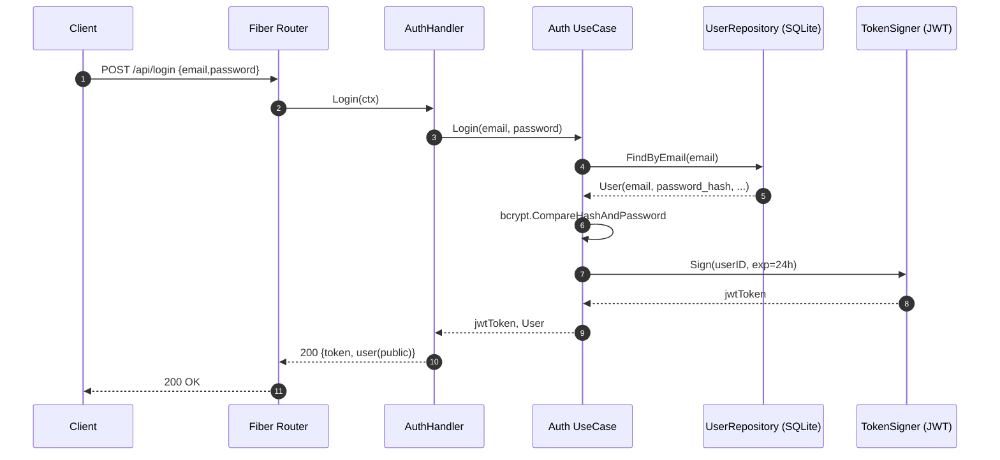
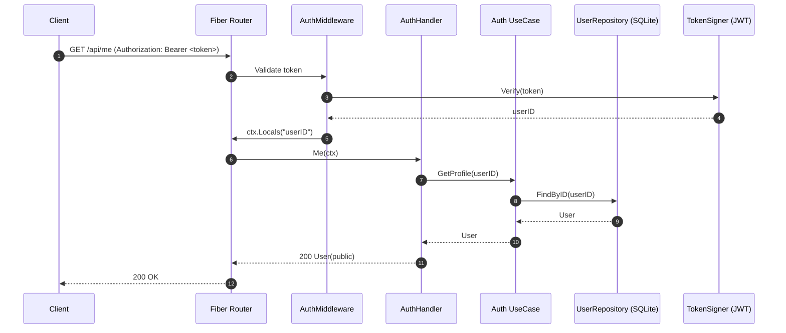
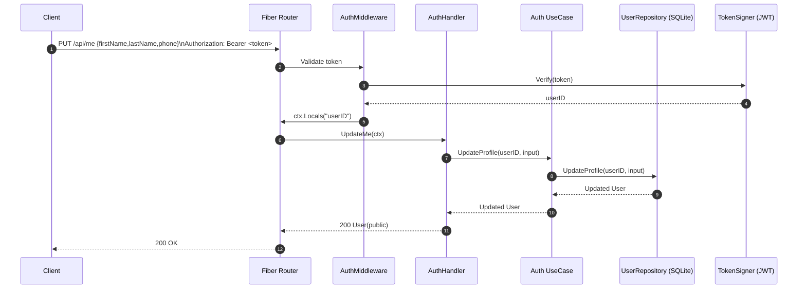

## Sequence Diagrams

### POST /api/login

```mermaid
sequenceDiagram
  autonumber
  participant C as Client
  participant R as Fiber Router
  participant H as AuthHandler
  participant U as Auth UseCase
  participant UR as UserRepository (SQLite)
  participant T as TokenSigner (JWT)

  C->>R: POST /api/login {email,password}
  R->>H: Login(ctx)
  H->>U: Login(email, password)
  U->>UR: FindByEmail(email)
  UR-->>U: User(email, password_hash, ...)
  U->>U: bcrypt.CompareHashAndPassword
  U->>T: Sign(userID, exp=24h)
  T-->>U: jwtToken
  U-->>H: jwtToken, User
  H-->>R: 200 {token, user(public)}
  R-->>C: 200 OK
```

### GET /api/me

```mermaid
sequenceDiagram
  autonumber
  participant C as Client
  participant R as Fiber Router
  participant M as AuthMiddleware
  participant H as AuthHandler
  participant U as Auth UseCase
  participant UR as UserRepository (SQLite)
  participant T as TokenSigner (JWT)

  C->>R: GET /api/me (Authorization: Bearer <token>)
  R->>M: Validate token
  M->>T: Verify(token)
  T-->>M: userID
  M->>R: ctx.Locals("userID")
  R->>H: Me(ctx)
  H->>U: GetProfile(userID)
  U->>UR: FindByID(userID)
  UR-->>U: User
  U-->>H: User
  H-->>R: 200 User(public)
  R-->>C: 200 OK
```

### PUT /api/me

```mermaid
sequenceDiagram
  autonumber
  participant C as Client
  participant R as Fiber Router
  participant M as AuthMiddleware
  participant H as AuthHandler
  participant U as Auth UseCase
  participant UR as UserRepository (SQLite)
  participant T as TokenSigner (JWT)

  C->>R: PUT /api/me {firstName,lastName,phone}\nAuthorization: Bearer <token>
  R->>M: Validate token
  M->>T: Verify(token)
  T-->>M: userID
  M->>R: ctx.Locals("userID")
  R->>H: UpdateMe(ctx)
  H->>U: UpdateProfile(userID, input)
  U->>UR: UpdateProfile(userID, input)
  UR-->>U: Updated User
  U-->>H: Updated User
  H-->>R: 200 User(public)
  R-->>C: 200 OK
```

